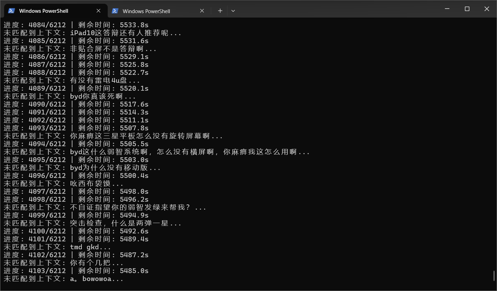
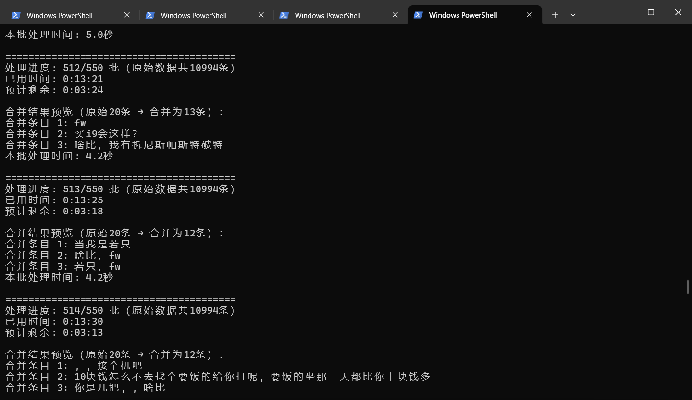
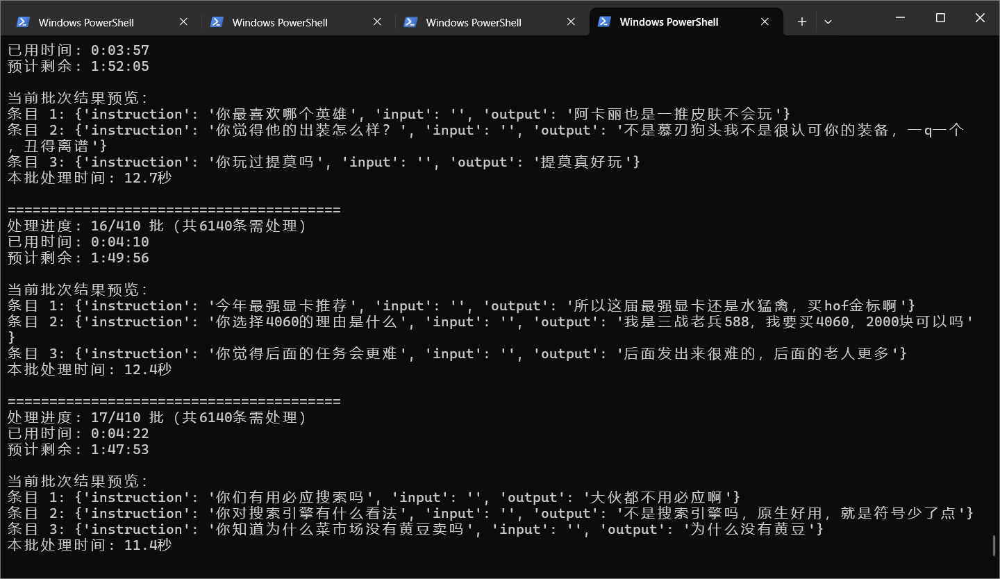

# 群成员聊天风格微调指引

额外说明：该指引主要作笔记用，简单分享，如果您有更好的方案可以再提出，不专业之处请谅解。

脚本有些参数需要在代码文件中修改，空闲时间不多，没法做成更完善的程序，请谅解。

案例设备：RTX3060 12G VRAM / 32G RAM

## 数据预处理

### 聊天记录获取（QQNT）

- QQ 聊天记录 sqlite 数据库文件及其密钥获取：https://github.com/QQBackup/qq-win-db-key
  - 用 DB Browser (SQLCipher) 解密数据库文件，并以 JSON 格式导出聊天记录
- 聊天记录文本解析程序（您如果直接查看数据库的话，文本内容是乱码）
  - 位于本仓库中的 `qq_nt_parse` 目录（需安装相关依赖）
  - 修改 `main.py` 中的相关参数然后运行
  - 参考了：https://github.com/QQBackup/qq-win-db-key/issues/38#issuecomment-2294619825

### 初始聊天记录 CSV 文件格式要求

符合格式要求的目的是使用后续的处理脚本

- 无表头
- 1-5列分别为：
  - 群号、日期（格式如`2022-08-14T10:12:18Z`）
  - 用户昵称
  - 用户ID
  - 聊天内容（格式如`['片段1', '片段2']`）

### 数据集用户输入补充（方案一/推荐）

#### 1. 按固定逻辑合并、缩减所有聊天记录

需修改代码文件中的参数，然后运行

- auto-combine-group-msg_no-llm.py

程序流程大致如下：
1. 去除聊天内容中的`@用户昵称`部分以及部分特殊文本（具体请直接参考代码）
2. 丢弃聊天内容数组中文本为空或仅空格的片段，然后合并它们，以`，`分隔。
3. 对于每个用户，如果他的聊天记录之间**穿插的他人聊天记录条数小于等于2**，且该用户ID的聊天记录**时间间隔小于1分钟**，那么**合并**这些聊天记录，并按**平均值**指定合并后的聊天记录的时间。
4. 按时间顺序从小到大排序合并后的聊天记录。
5. 计算排序后的每条聊天记录距离上一条已经过去的时间，格式为`<int>秒 `
6. 最终取聊天记录中的 **用户ID**、**聊天内容**、**距离上一条聊天记录过去的时间** 这3项，组成新列表，以 JSON 格式导出数据到文件。

#### 2. 要求 LLM 选出被目标用户回复的聊天记录序号

**建议根据自己需要修改一下代码文件中的提示词**

使用 Ollama LLM 后端（您也可以参考其中 prompt，自己编写脚本）

- auto-pair-group-msg.py

程序流程大致如下：
1. 取目标用户的聊天记录以及其前面10条聊天记录
   - 如果前面10条中又有该用户的聊天记录，那么到此就截断
   - 如果前1条聊天记录和目标用户的聊天记录内容一致，则丢弃目标用户的这条消息
2. 调用 Ollama API 询问 LLM 目标用户是回复上面的哪条消息，找不到则丢弃
3. 然后整理出对话，并保存到文件（找到的以及未找到的）

#### 3. 使用 LLM 生成未找到被回复消息的聊天记录的前文

参考下面的 [使用-llm-猜测生成-alpaca-数据集中提问内容](#3-使用-llm-猜测生成-alpaca-数据集中提问内容)

### 数据集用户输入补充（方案二）

#### 1. CSV 转 Alpaca 数据集

需修改代码文件中的参数，然后运行

可选脚本：
- `proceed-group-msg.py`: 简单将前面的消息作为提问，生成 Alpaca 数据集
- `proceed-group-msg_user-at.py`: 简单将@目标用户的消息作为提问，生成 Alpaca 数据集
- `proceed-group-msg_user-empty.py`: 提问设为空，生成 Alpaca 数据集，交由后续处理，**推荐**

可再检查一遍是否有空答复内容的记录，替换删除可能存在的 `[表情]`、`，，` 文本片段

#### 2. 使用 LLM 合并、缩减 Alpaca 数据集中答复内容

通过命令行搭配参数使用 python 脚本

使用 Ollama LLM 后端（您也可以参考其中 prompt，自己编写脚本）

- `auto-combine-group-msg.py`: 使用现有 LLM 合并其中有关联的几句话，以增加答复长度，减少数据集大小
  - `input`, `output` 参数所指文件需**不同**，output 文件可为空。可使用断点参数，断点续传
  - 推荐参数
    - `--batch-size 20`
    - 模型默认（`qwen2.5:14b`）

可再检查一遍是否有空答复内容的记录

#### 3. 使用 LLM 猜测生成 Alpaca 数据集中提问内容

通过命令行搭配参数使用 python 脚本

**建议根据自己需要修改一下代码文件中的提示词**

使用 Ollama LLM 后端（您也可以参考其中 prompt，自己编写脚本）

- `auto-gen-group-msg.py`: 使用现有 LLM 根据答复内容为每条聊天记录生成对应的其他成员的聊天前文
  - `input`, `output` 参数所指文件需**相同**，可使用断点参数，断点续传
  - 推荐参数
    - `--batch-size 15`
    - 模型默认（`qwen2.5:14b`）

可再检查一遍是否有空提问和空答复内容的记录

## 训练

使用 LLaMA Factory

推荐阅读：https://zhuanlan.zhihu.com/p/15084326626

- LoRA SFT 微调
- 学习率可改为比默认更高的
- 若生成内容乱码、lose 为 0，可使用 `f16` 而不是 `b16`
- 训练开始的几分钟内就应当看到 lose 下降
- 成功案例：RTX3060 12G / Qwen2.5-1.5B-Instruct

## 导出和部署

- 需使用 LLaMA Factory 导出功能
- 使用 `ollama create` 命令，指定 modelfile 为导出模型的 `ModelFile` 文件
- 聊天平台可选择 Langbot